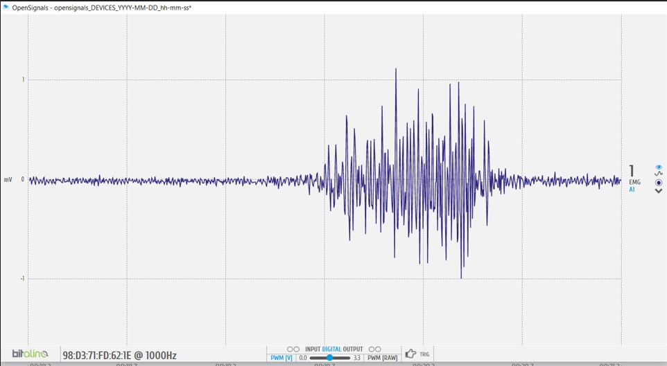
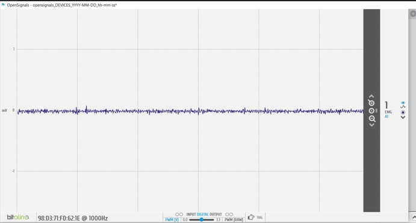
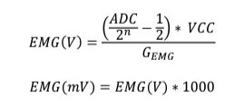

# Laboratorio 3: Adquisición EMG Bitalino
## Tabla de contenidos:
* [Objetivos](#objetivos)
* [Materiales y equipos](#materiales-y-equipos)
* [Electromiografía](#emg)
* [Entregables](#entregable)
  * [Fotos de conexión usada (Electrodos-cuerpo, BITalino-cables)](#conexión-usada)
  * [Video de señal](#video-de-señal)
  * [Ploteo de la señal en OpenSignals](#gráficos-opensignals)

  * [Archivo de los datos de la señal ploteada](#archivos)
  * [Ploteo de la señal en Python.](#gráficos-en-python)
   * [Explicación de las señales](#explicación-final)
* [Bibliografía](#bibliografía)
 

## Objetivos:

* Adquirir señales biomédicas de EMG .
* Hacer una correcta configuración de BiTalino.
* Extraer la información de las señales EMG del software OpenSignals (r)evolution.

## Materiales y equipos:

<div align="center">

|  **Modelo**  | **Descripción** | **Cantidad** |
|:------------:|:---------------:|:------------:|
| (R)EVOLUTION |   Kit BITalino  |       1      |
|       -      |      Laptop     |       1      |

</div>

## Electromiografía
La electromiografía (EMG) es una técnica experimental que se encarga del desarrollo, registro y análisis de señales mioeléctricas. Las señales mioeléctricas se forman por variaciones fisiológicas en el estado de membranas de las fibras musculares.

Unidad Motora:

La unidad motora es la  unidad funcional más pequeña para describir el control neural del proceso de contracción muscular.El término unidades describe el comportamiento de que todas las fibras musculares de una unidad motora determinada actúan "como una sola" dentro del proceso de inervación.

Estas contracciones se realizan mediante polarizaciones y despolarizaciones de la membrana por la diferencia de potencial (potencial de acción ) que se mantiene mediante procesos fisiológicos (bomba de iones sodio y potasio ) que  da como resultado una carga intracelular negativa en comparación con la superficie externa .[1]

<image src ="Imagenes/rep.png"> 

La señal EMG se basa en potenciales de acción en la membrana de la fibra muscular resultantes de la despolarización. y procesos de repolarización como se describe anteriormente. La extensión de esta zona de despolarización  se describe en la literatura vista como aproximadamente 1-3 mm² . Después de la excitación inicial, esta zona viaja a lo largo de la fibra muscular a una velocidad de 2-6 m/s y pasa por el lado del electrodo.

El ciclo de despolarización-repolarización forma una onda de despolarización  que viaja a lo largo de la superficie de una fibra muscular .Debido a que una unidad motora consta de muchas fibras musculares, el par de electrodos "observa" la magnitud de todas las fibras inervadas dentro de esta unidad motora, dependiendo de su distancia espacial y resolución.Normalmente, se resumen en un potencial de acción de unidad motora trifásico , que difiere en forma y tamaño dependiendo de la orientación geométrica de la fibra en relación con el sitio del electrodo.[1]

## Entregables:
### Participantes :

Se adquirieron señales  4 participantes para el laboratorio.

|  **Participante**  | **Edad** | **Actividad fisica** |
|:------------:|:---------------:|:------------:|
| Participante 1 |   20  |       No hace ejercicio     |
|       Participante 2   |      21   |    Hace ejercicio regularmente ,2 horas diarias de lunes a viernes.Practica taekwondo    |
| Participante 3 |   22 |       No hace ejercicio |
|   Participante 4    |      22    |       Hace ejercicio 2 días a la semana      |

La participante 2 y 3 son del sexo femenimo , mientras que el 1 y 4 son del masculino.

### Paquete muscular:
Para este laboratorio de se analizara la actividad de flexion del  músculo braquial .Es un músculo  de la región anterior del brazo, donde cubre a los músculos coracobraquial y braquial anterior. El bíceps es un músculo que permite la movilidad del brazo, y realiza la flexión del codo.
El bicep  suele ser un músculo visible y bien definido por lo que  facilitó la colocación de electrodos.


La elección de este paquete muscular radica en que se analizara el movimiento de flexión codo  que implica doblar el brazo en el codo, acercando la mano al hombro, esto se hara en conjunto con  carga de  un peso de aproximadamente 2 kilos para cada participante y se vera el cambio en la señal EMG , se hara repeticiones de reposo y flexión para una mejor obtencion de la señal.

### Conexión usada:
Para el circuito , se hizo uso del cable de tres hilos con tres de los electrodos no invasivos. 
El cable de 3 hilos se conecto al puerto 1 ya que se utilizara EMG en el laboratorio . Por ultimo se conecto la bateria y se encendio el switch

<p align="center">


Para plotear  la señal obtenida, se colocó los electrodos en la posición que se muestra en la siguiente figura. 

<p align="center">


Los electrodos positivo y negativo se colocaron en la zona del bícep braquial y el electrodo tierra  o blanco se coloco en el hueso del codo.

<p align="center">


Luego de ello , se conectó   el BiTalino por Bluetooth con el programa  OpenSignals para poder visualizar la señal deseada y se realizaron dos pruebas: una con el musculo en reposo, silencio electrico  y el otro aplicando flexión .

Prueba 1 :Músculo en reposo

<p align="center">


Prueba 2: Músculo contraido por la carga (peso de la mochila)

<p align="center">


### Video de señal 
En el siguiente video de youtube se muestran las conexiones electrodos-cuerpo y visualización de la Señal en OpenSignals para el Participante 1 .
Se muestra tanto la señal en reposo y en flexión:

<div align="center">

[](https://youtu.be/x2EW0gc3TLQ)


</div>

### Gráficos OpenSignals
Participante 1
 - Señal del bícep en reposo:
<p align="center">

</p>

 - Señal del bícep en flexión:
<p align="center">

</p>
Participante 2

 - Señal del bícep en reposo:
<p align="center">

</p>

 - Señal del bícep en flexión:
<p align="center">

</p>
Participante 3

 - Señal del bícep en reposo:
<p align="center">

</p>

 - Señal del bícep en flexión:
<p align="center">

</p>
Participante 4

 - Señal del bícep en reposo:
<p align="center">

</p>

 - Señal del bícep en flexión:
<p align="center">

</p>


### Archivos
Por otro lado podemos encontrar los archivos de la señal ploteada, tando del músculo del voluntario en reposo como en el contraido, en el inicio del repositorio.

-[Archivos txt de cada participante](https://github.com/arianacarbajal/ISB_Grupo3/tree/c17262d60ffebf4060745d3c3b1e1313f74ecaa9/ISB/Laboratorios/Txt_emg)

-[Archivos ipny con codigo de cada participante](https://github.com/arianacarbajal/ISB_Grupo3/tree/c17262d60ffebf4060745d3c3b1e1313f74ecaa9/ISB/Laboratorios/Ipny_emg)

### Codigo utilizado para los graficos en Phyton
El código contiene comentarios para el mejor entendimiento de la lógica usada.

Es importante mencionar que la señal determinada se encuentra en señal digital BiTalino ,para pasar esta señal a milivoltios, se realiza esta conversión mediante esta fórmula. 

<p align="center">

</p>

Esto esta incluido en el codigo , asi pudimos obtener las señales en el rango que se nos mostraba en Bitalino de mv para realizar un mejor analisis de la señal.

```
import numpy as np
import matplotlib.pyplot as plt
import pandas as pd
import seaborn as sns
import re

f = open("N.txt","r")
raw_data = f.read()  # con f.read() leemos todo el contenido
f.close()

raw_data
Fs = 1000
Ts = 1/Fs
print(f" Fs={Fs} hz\n Ts={Ts} s")

a = np.genfromtxt("./N.txt", delimiter="\t",skip_header = 3)
yarray = a[:, 5]
N=len(yarray)
bits = 10 # Bits de la salida
volt_range = 3.3
yarray = (yarray/2**bits -1/2) * volt_range/1009
yarray=yarray*1000 # convertir los bits a mV
yarray = yarray - np.mean(yarray) # Centrar la señal, ya que va de -1.64 a 1.64
xarray = np.arange(1, len(yarray)+1)/Fs
print(yarray)
xarray=xarray
plt.plot(xarray, yarray, label="señal")
plt.grid(linestyle=":")
plt.xlabel("Tiempo (s)")
plt.ylabel("Amplitud en mV")
plt.legend(loc="upper right")
plt.figure()
plt.plot(xarray, yarray, label="señal en reposo")
plt.grid(linestyle=":")
plt.xlabel("Tiempo (s)")
plt.ylabel("Amplitud en mV")
plt.legend(loc="upper right")
plt.xlim(0, 5)
plt.figure()
plt.plot(xarray, yarray, label="señal en esfuerzo")
plt.grid(linestyle=":")
plt.xlabel("Tiempo (s)")
plt.ylabel("Amplitud en mV")
plt.legend(loc="upper right")
plt.xlim(5, 40)


# Calcular la FFT de la señal original
signal_fft = np.fft.fft(yarray)
frequencies = np.fft.fftfreq(N, Ts)

# Reorganizar las frecuencias para que estén en el rango de -Fs/2 a Fs/2
frequencies = np.fft.fftshift(frequencies)
signal_fft = np.fft.fftshift(signal_fft)


# Graficar la FFT normalizada
plt.figure(figsize=(8, 6))
plt.plot(frequencies, np.abs(signal_fft), label="FFT Normalizada")
plt.grid(linestyle=":")
plt.xlabel("Frecuencia (Hz)")
plt.ylabel("Amplitud")
plt.legend(loc="upper right")
plt.xlim(0, Fs/2)  # Limitar el rango de frecuencias de 0 a Fs/2 Hz en la gráfica

plt.figure()
plt.plot(frequencies, 20*np.log10(np.abs(signal_fft)), label="FFT Normalizada en dB")
plt.grid(linestyle=":")
plt.xlabel("Frecuencia (Hz)")
plt.ylabel("Amplitud")
plt.legend(loc="upper right")
plt.xlim(0, Fs/2)

plt.show()
plt.show()
```
### Gráficos en Python
Posteriormente se pudo procesar la señal adquirida con ayuda de un codigo compilado en Python, con lo que se obtuvieron las señales.

Participante 1
 - Señal del bícep completa:
<p align="center">

</p>

 - Señal del bícep en reposo:
<p align="center">

</p>

 - Señal del bícep en flexión:
<p align="center">

</p>

 - FFT normalizada en Hz de  Señal del bícep completa:
<p align="center">

</p>

  - FFT normalizada en DB de  Señal del bícep completa:
<p align="center">

</p>

Participante 2
 - Señal del bícep completa:
<p align="center">

</p>

 - Señal del bícep en reposo:
<p align="center">

</p>

 - Señal del bícep en flexión:
<p align="center">

</p>

 - FFT normalizada en Hz de  Señal del bícep completa:
<p align="center">

</p>

  - FFT normalizada en DB de  Señal del bícep completa:
<p align="center">

</p>

Participante 3
 - Señal del bícep completa:
<p align="center">

</p>

 - Señal del bícep en reposo:
<p align="center">

</p>

 - Señal del bícep en flexión:
<p align="center">

</p>

 - FFT normalizada en Hz de  Señal del bícep completa:
<p align="center">

</p>

  - FFT normalizada en DB de  Señal del bícep completa:
<p align="center">

</p>

Participante 4
  - Señal del bícep completa:
<p align="center">

</p>

 - Señal del bícep en reposo:
<p align="center">

</p>

 - Señal del bícep en flexión:
<p align="center">

</p>

 - FFT normalizada en Hz de  Señal del bícep completa:
<p align="center">

</p>

  - FFT normalizada en DB de  Señal del bícep completa:
<p align="center">

</p>


### Explicación de las señales


## Bibliografía
[1]“The ABC of EMG”. The ABC of EMG. Accedido el 9 de septiembre de 2023. [En línea]. Disponible: https://hermanwallace.com/download/The_ABC_of_EMG_by_Peter_Konrad.pdf


[2]Support PLUX Biosignals official – Official PLUX support and biosignals knowledge base. Accedido el 9 de septiembre de 2023. [En línea]. Disponible: https://support.pluxbiosignals.com/wp-content/uploads/2022/04/HomeGuide1_EMG.pdf