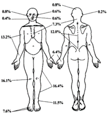

# Development of a Machine Learning Model for Muscle Fatigue Monitoring in the Lateral Vastus Muscle during Static Bicycle Rehabilitation using sEMG: Optimization of Rehabilitation Routines and Prevention of Muscle Injuries

## Tabla de contenido

- [Introducción](#Introducción).
- [Objetivos del proyecto](#Objetivo).
- [Problemática](#Problemática).
- [Estado del arte](#estado).
- [Propuesta de solución](#propuesta).
- [Metodología del proyecto](#Metodología).
- [Integrantes del proyecto](#Integrantes_del_proyecto).
- [Bibliografía](#Bibliografía).

### Introducción

La fatiga se utiliza comúnmente para describir  aumento de la dificultad real o percibida para realizar una actividad física.En otras palabras, es la  incapacidad de mantener un nivel requerido de fuerza muscular, por ende,ocasiona que la persona detenga  o disminuya el esfuerzo físico  que está realizando. La fatiga depende de varios factores  entre las que se encuentran las relacionadas con el ejercicio (tipo de ejercicio, velocidad, duración de la contracción muscular,etc) y/o factores relacionados con el individuo en actividad (reservas energéticas, sexo, edad, condición física, estado emocional, niveles de estrés, entre otros ).
En actividad física máxima , la fatiga proviene de una disminución neuromuscular en la producción de fuerza ocasionadas por diferentes fenómenos fisiológicos .Estos fenómenos  se diferencian por tipo de fatiga: periférica y central. [1]

La fatiga periférica se caracteriza por la reducción de la fuerza a nivel de las fibras musculares, principalmente en el entorno en el que se encuentran. Este fenómeno puede afectar diversos aspectos, como el acoplamiento excitación-contracción, la disponibilidad de sustratos metabólicos, las condiciones intracelulares, el flujo sanguíneo muscular y las propiedades intrínsecas del aparato contráctil. Estos factores contribuyen a la compleja manifestación de la fatiga periférica, influenciando la capacidad del músculo para generar fuerza eficientemente. [1]

Por otro lado ,la fatiga central se manifiesta como una reducción en la frecuencia de descargas de las unidades motoras inicialmente reclutadas para la generación de fuerza. Este fenómeno puede tener ocurrir a diversos niveles, incluyendo la corteza motora, motoneuronas, vías piramidales y metaborreceptores. Entre los mecanismos asociados a la fatiga central, se destaca principalmente el bloqueo de la conducción de potenciales de acción  en los sitios de unión que mencionamos anteriormente, lo que ocasiona  en una pérdida de activación de las fibras musculares.Respecto a los  avances en la comprensión de estos procesos, la importancia precisa de la fatiga central sigue siendo objeto de investigación hasta la fecha.[1] 

Nosotros nos enfocaremos en la fatiga periférica , la cual se puede generar antes o durante la rehabilitación del deportista si no se tiene un monitoreo adecuado de su rendimiento.

En el deportista;el ejercicio intenso que realizan debido a sus mismas rutinas de su respectivo deporte (fútbol,natación y ciclismo ) le  generan daño muscular ,por lo que se limita su  rendimiento al  disminuir la fuerza, la velocidad o pico de potencia de los músculos . Por ende, es indispensable conocer  qué medios de recuperación muscular disponen .

Los métodos de rehabilitación para deportistas  se separan entre el tipo de ejercicio que se requiera realizar: aeróbico o anaeróbico.[2]El ejercicio aeróbico se refiere a la actividad física en la cual la ingesta de oxígeno se encuentra en equilibrio . Estos ejercicios se caracterizan por ser de baja intensidad y prolongada duración, típicamente entre 30 y 60 minutos, durante los cuales se queman tanto hidratos de carbono como grasas para la obtención de energía. Por otra parte, el  ejercicio anaeróbico se determina por la intensidad del esfuerzo y la duración del mismo , siendo de alta intensidad pero de corta duración, comúnmente  de 30 a 120 segundos. En este tipo de actividad, se busca utilizar una cantidad significativa de energía en un breve lapso de tiempo. [2]

Respecto a la rehabilitación , el ejercicio aeróbico utiliza  bandas sin fin, bicicleta estática y elíptica . Mientras que en los ejercicios anaeróbicos, se utilizan  bandas motorizadas y bicicletas estáticas.Este último tipo de ejercicio debe presentar mayor velocidad  que el primero , debido a que presenta una alta intensidad de trabajo y un  corto tiempo de duración en la rehabilitación.  [2]

Como lo indicado anteriormente, es importante monitorear el rendimiento de la rehabilitación  a fin de evitar lesiones como la fatiga muscular .Para esto, se utiliza la electromiografía de superficie(sEMG) .El sEMG es el análisis de una señal eléctrica generada por la actividad muscular durante la contracción y relajación muscular  mediante electrodos  .Esta  permite obtener información sobre la producción de fuerza en el músculo esquelético que se encuentra  vinculada a mecanismos contráctiles.Gracias a su naturaleza no invasiva y por su amplia utilización en áreas como la ergonomía y biomecánica ocupacional, es recomendable utilizar este método para monitorear el rendimiento del deportista y estimar una posible fatiga.[2]

### Objetivos del proyecto

General: 
 

Desarrollar un sistema de monitorización de fatiga muscular basado en sensores sEMG que optimice la rehabilitación y prevenga lesiones de sobre exigencia muscular en pacientes que realizan ejercicios en bicicleta estática.
  

Específicos:

- Diseñar y construir un sistema de adquisición de señales sEMG para obtener nuestras señales de interés.
 

- Lograr un correcto filtrado y procesamiento de la señal para poder obtener la medición de la actividad del músculo vasto lateral de forma precisa.
   

- Desarrollar un modelo de aprendizaje automático capaz de analizar las señales sEMG recopiladas y detectar patrones asociados a la fatiga muscular en el músculo vasto lateral.
  

- Implementar un sistema de alerta temprana que notifique al paciente y al terapeuta cuando se detecten signos de fatiga muscular, con recomendaciones específicas para disminuir la intensidad del ejercicio.

### Problemática
El presente proyecto se está centrando en personas físicamente activas, que presentan o pueden presentar lesiones. Revisando la incidencia de lesiones musculares, podemos notar que las extremidades inferiores son las más afectadas, representando el 51.6% de las lesiones[5]. 

   

   Imagen : Diagrama de incidencia de lesiones musculares dependiendo de la zona.
   

    
Estos datos pueden variar un poco dependiendo de la naturaleza de la actividad física que realiza el sujeto, sin embargo, la prevalencia en las extremidades inferiores suele ser mayor, lo cual otorga mayor importancia al monitoreo de esta zona. De estos datos también es importante notar que las lesiones musculares y de tendón representan el 53.8% y que el 65.7% de las lesiones son causadas por sobreuso[5], estadística que se eleva si se evalúa exclusivamente el tiempo de entrenamiento y no de competencia.

Tomando en cuenta la recurrencia de las lesiones musculares por sobre exigencia en las extremidades inferiores, notamos que el monitoreo de la actividad muscular en esta zona es crucial. Lo ideal sería realizar este  monitoreo tanto en personas sanas como en personas realizando rehabilitación física después de una lesión.

En personas sanas la fatiga muscular, es un importante factor de riesgo para sufrir lesiones futuras[6] y en personas que se encuentran en proceso de rehabilitacion, la falta de una terepia de rehabilitacion certera puede generar que la zona se sobreexija y agrave la lesion o empeore el pronostico inicial[7], consecuentemente no se recupere completamente y sea propensa a volver a lesionarse nuevamente, inhabilitando a la persona por un mayor periodo de tiempo[8].

Para ser más precisos, sin un monitoreo de la fatiga, es difícil poder detener los ejercicios oportunamente para establecer periodos de recuperación que nos permitan evitar la acumulación de fatiga, lo cual genera en el paciente una baja tolerancia a cargas, disminución de rendimiento, aumento de riesgo de lesiones y alteraciones cognitivas[9].

Dicho esto, hemos decidido concentramos específicamente en el ejercicio de bicicleta estática, por dos razones importantes:  
 

1. Es un ejercicio idóneo para la rehabilitación de lesiones del miembro inferior ya que es posible modificar la altura del asiento y la posición de los pedales para centrarse específicamente en la actividad de los músculos y aliviar los ligamentos.
  

2. Implica la activación de músculos vasto interno, externo, crural y recto anterior femoral que, como vimos, son propensos a las lesiones de sobrecarga específicamente generadas por las grandes cargas que debe soportar el tendón rotuliano y son los de mayor participación en el proceso de pedaleo[10].

“falta de monitoreo de fatiga muscular en el músculo vasto lateral durante el ejercicio en bicicleta estatica, en individuos sanos de manera preventiva o que estén en procesos de rehabilitación, para prevenir complicaciones y optimizar el proceso de rehabilitación”

### Estado del arte

 
 
En el contexto de este estado del arte, se ha realizado una revisión exhaustiva de investigaciones previas con el propósito de evaluar metodologías y precisiones, así como de analizar los paquetes musculares que han sido objeto de estudio. Los siguientes estudios han sido examinados detenidamente para comprender las técnicas empleadas en la detección de la fatiga muscular, lo que ha sido esencial en la determinación de nuestra estrategia de investigación.

 
El paper, titulado "A Muscle Fatigue Classification Model Based on LSTM and Improved Wavelet Packet Threshold," [11] se enfocó en proponer un nuevo método para la clasificación automática de la fatiga muscular basado en la electromiografía de superficie (sEMG). Durante este proceso, se analizaron los músculos vasto recto femoral (RF), vasto lateral (VL), vasto medial (VM) y gastrocnemio (GA) de la pierna izquierda en 20 participantes durante una prueba incremental en un ergómetro de ciclo. La metodología incluyó el uso de la transformada wavelet packet y la aplicación de un algoritmo de eliminación de ruido mediante umbral de paquete wavelet mejorado para el análisis de señales sEMG. Se extrajeron características tanto en el dominio del tiempo como en el de la frecuencia de las señales sEMG. Además, se propuso un modelo de reconocimiento de fatiga muscular basado en la red LSTM, que fue entrenado para clasificar la fatiga muscular utilizando estas características. Los resultados revelaron que el algoritmo de umbral de paquete wavelet mejorado superó a otros métodos de umbral, y que el modelo LSTM demostró un mejor rendimiento en la clasificación de la fatiga muscular en comparación con modelos como CNN, SVM y BFA-GSVCM.

 
El objetivo del paper, titulado "Strategies to Identify Changes in SEMG Due to Muscle Fatigue During Cycling," [12]es presentar una técnica no invasiva para medir la fatiga muscular durante actividades cíclicas utilizando análisis espectral de ventanas estrechas de electromiografía de superficie (SEMG). El paquete muscular analizado son los músculos cuádriceps durante el ciclismo. La metodología utilizada consiste en establecer una referencia en cada ciclo para determinar los cambios en la señal SEMG, utilizando una ventana de 100 ms en el pico de la actividad muscular. Además, se considera la relación entre la frecuencia mediana y la raíz cuadrada media para identificar el cambio en la fatiga muscular. El estudio se realizó con 11 voluntarios masculinos moderadamente activos, y se utilizó un ergómetro Lode para realizar una prueba de fatiga de 30 segundos. Los resultados muestran una relación altamente significativa entre la reducción de la frecuencia mediana y el inicio de la fatiga muscular.

El objetivo del estudio "Evaluation of the Electromyography Test for the Analysis of the Aerobic-Anaerobic Transition in Elite Cyclists during Incremental Exercise" [13] fue investigar la validez y fiabilidad de la electromiografía de superficie (EMG) para la detección automática de los umbrales aeróbico y anaeróbico durante una prueba de ejercicio continuo incremental utilizando períodos de ejercicio de 1 minuto en ciclistas de élite. Se analizaron los paquetes musculares vasto lateral, vasto medial, bíceps femoral y glúteo máximo. Dieciséis ciclistas bien entrenados completaron una prueba de ejercicio incremental (25 W/1 min) hasta el agotamiento. Se midieron las siguientes variables para evaluar la fatiga: la potencia máxima alcanzada, la frecuencia cardíaca, la concentración de lactato en sangre y la raíz cuadrada media (RMS) de las señales EMG. Los resultados mostraron que la EMG de superficie es una herramienta válida y fiable para la detección automática de los umbrales aeróbico y anaeróbico en ciclistas de élite durante una prueba de ejercicio continuo incremental.

 
El artículo, titulado “Assessment of Muscles Fatigue Based on Surface EMG Signals Using Machine Learning and Statistical Approaches: A Review”[14],  revisa los métodos para detectar la fatiga muscular a través de señales de EMG de superficie utilizando enfoques estadísticos y de aprendizaje automático. Los autores analizaron 15 estudios que investigan la fatiga muscular en diferentes músculos de la pierna, incluyendo el vasto lateral, gastrocnemio y tibial anterior. Los resultados muestran que los enfoques de aprendizaje automático y estadísticos son efectivos para detectar la fatiga muscular en los músculos de la pierna, con una precisión promedio del 90%. Los métodos que dieron mejores resultados fueron el análisis de componentes principales (PCA) y el análisis de discriminante lineal (LDA). Las variables utilizadas en estos enfoques incluyen la amplitud de la señal EMG, la frecuencia y la duración de la contracción muscular. Estos enfoques permiten una detección temprana de la fatiga muscular, lo que puede ser útil para prevenir lesiones en atletas y mejorar la rehabilitación en pacientes con enfermedades neuromusculares.

 
‌El objetivo del estudio "Un estudio comparativo de índices EMG en la evaluación de la fatiga muscular durante el ejercicio de ciclismo al máximo esfuerzo" [15] fue evaluar la utilidad de diferentes índices EMG en la evaluación de la fatiga muscular inducida por el ejercicio de ciclismo al máximo esfuerzo. Los músculos analizados fueron el vasto lateral (VL), el bíceps femoral (BF) y el gastrocnemio medial (GM). Se reclutaron 12 ciclistas altamente entrenados para realizar un ejercicio de ciclismo al máximo esfuerzo y se midieron los índices EMG de los músculos VL, BF y GM durante el ejercicio. Se utilizó el análisis de correlación gris para evaluar la relación entre los diferentes índices EMG y la fatiga muscular. Las variables utilizadas para medir la fatiga muscular fueron la frecuencia mediana (MF), la frecuencia media (MNF), la potencia media de la frecuencia (MPF) y la relación de potencia mediana (MMP).Además, se encontró que la frecuencia mediana (MF) y la frecuencia media (MNF) fueron los índices EMG más sensibles para detectar la fatiga muscular en los tres músculos analizados.

### Propuesta de solución

 Ante la presente problemática, la propuesta de solución consiste en desarrollar un sistema de monitorización de fatiga muscular basado en sensores sEMG para optimizar la rehabilitación y prevenir lesiones de sobre exigencia muscular durante la realización de ejercicios en bicicleta estática.

Se seleccionó el músculo vasto lateral de la pierna (VL) como el foco central de este estudio debido a su destacado papel como generador principal de potencia durante la práctica del ciclismo [16]. Además se optó por utilizar aprendizaje automático debido a su capacidad inherente para analizar de forma precisa y eficiente las complejas señales de electromiografía de superficie (sEMG), identificando patrones de fatiga muscular. 

Selección de Sujetos de Estudio
El estudio incluyó  personas entre 18 y 40 años de edad que realicen actividad física regular y que no hayan realizado ejercicio intenso en los tres días previos a la prueba. Se excluirán personas con enfermedades cardiovasculares, neuromusculares o metabólicas diagnosticadas.

El protocolo inició con la obtención de datos antropométricos  de los participantes tales como peso , talla y se hizo un cálculo de IMC. Posteriormente se solicitó a los participantes que completen el cuestionario de actividad física IPAQ ,  

Posteriormente , se solicitó a los participantes completar el Cuestionario Internacional de Actividad Física (IPAQ por sus siglas en inglés), ampliamente utilizado para la evaluación estandarizada de los niveles de actividad física. El IPAQ permite la cuantificación de tres dimensiones principales: intensidad categorizada como leve, moderada o vigorosa según valores estandarizados de equivalente metabólico de la tarea (MET por sus siglas en inglés) por minuto; frecuencia definida como número de días por semana; y duración correspondiente al tiempo en minutos por día. A partir de esta información, y utilizando los puntajes MET-minuto/semana, se clasificó a los participantes en tres niveles de actividad física de acuerdo a cortes previamente establecidos: bajo, moderado y alto. Los resultados del IPAQ facilitaron la caracterización de la condición física basal de los participantes y su incorporación en los análisis posteriores.

Adquisición de Señales EMG

La preparación del equipo y materiales incluyó la utilización de la bicicleta estática Indoor Tour de France de Proform, electrodos desechables de alta adherencia de Ag/AgCl, gel conductor y módulo Bitalino.

Los electrodos de superficie para EMG se ubicaron en los músculos vasto medial y lateral del cuádriceps, con un electrodo de referencia en el tendón rotuliano.

Figura 3.Colocación de electrodos

El protocolo inició con un calentamiento con estiramientos durante 5 minutos . Posteriormente se procedió a  la colocación de electrodos y la limpieza de la piel con alcohol , asegurando que la piel se encuentre libre de vello para evitar la interferencia con la adherencia de los electrodos. Luego de posicionar correctamente los electrodos se inició con el ejercicio .Se llevó a cabo un ejercicio incremental de 10 minutos de duración en una bicicleta estática. La visualización en tiempo real de la potencia generada durante el ejercicio en la pantalla de la bicicleta fue crucial dada la naturaleza progresiva del ejercicio, permitiendo observar los cambios graduales en este parámetro. Si bien la potencia no se modifica directamente en la bicicleta, ésta se ajustaba por el desempeño del participante al aumentarla cada 90 segundos. Simultáneamente, las señales electromiográficas (EMG) fueron registradas de manera sincronizada utilizando la plataforma Open Signals.

Para garantizar la correcta adquisición de las  señales, se desarrolló un estuche protector de dimensiones 152.995 x 126.417 x 34.832 mm, para la protección del dispositivo BITalino, con especial atención a la potencial generación de sudor durante la actividad física. Además cuenta con  una banda de velcro, para proporcionar una sujeción segura en la pierna durante la medición.

Preprocesamiento de Señales EMG
Una vez obtenidas las señales, con frecuencia de muestreo de 1000 Hz.), se emplearon filtros digitales para optimizar la señal electromiográfica (EMG). Se diseñó un filtro rechaza banda FIR con el propósito de eliminar eficazmente el ruido eléctrico a 60 Hz, común en entornos eléctricos. La frecuencia de corte se estableció en 60 Hz, con un ancho de banda estrecho de 3 Hz. Adicionalmente, se implementó un filtro pasabanda FIR que destacó la banda de interés para el análisis de la señal EMG. Este filtro se ajustó con frecuencias de corte de 6 a 500 Hz, abarcando el rango típico de las señales EMG, que oscilan entre +/- 5000 microvoltios y presentan contenido de frecuencia entre 6 y 500 Hz. El diseño de este filtro aseguró la retención de información relevante mientras elimina frecuencias no deseadas.

Etiquetado y creación del dataset
En la investigación, adoptamos un enfoque referenciado en prácticas previas donde proponen segmentar la señal electromiográfica (EMG) para analizar la actividad muscular en intervalos específicos, para cuantificar la actividad en cada segmento, se aplicó la técnica del Root Mean Square (RMS), proporcionando una medida representativa de la magnitud de la señal, se implementó un filtro de mediana a la nueva señal constituida por RMS para suavizar resaltar las características relevantes asociadas con la fatiga muscular, se llevó a cabo una clasificación de la señal electromiográfica (EMG) en dos clases distintas: "fatiga" y "no fatiga", la señal EMG fue dividida en segmentos de 8 segundos, lo que facilitó un análisis de la evolución temporal de la actividad muscular. 
Se aplicó estrategias similares propuestas en la literatura para la determinación del umbral de fatiga (PWCFT). La identificación del PWCFT se basó en observar la carga más baja que generaba una pendiente positiva significativa en la relación amplitud sEMG/tiempo. [10]
Para identificar los puntos de cambio significativos en la evolución del RMS, se utilizó la biblioteca de Python denominada "ruptures". Esta herramienta permitió la detección automatizada de transiciones relevantes en la señal, fundamentales para la posterior clasificación en las categorías de "fatiga" y "no fatiga". La elección de esta biblioteca se basó en su capacidad para detectar cambios bruscos.

Figura 7. Señal de RMS clasificada mediante un punto de cambio.(mV vs segundos)

Extracción y Selección de Características

Antes de llevar a cabo la extracción de características, se realizó un proceso de normalización de la media de los datos, dado que se identificaron irregularidades debido a factores externos.
En el proceso de extracción de características, se calcularon diversos parámetros con el objetivo de capturar la información relevante para clasificar fatiga en la señal EMG. Entre los parámetros calculados se incluyen la Raíz Media Cuadrática (RMS), la media, la desviación estándar y la amplitud de cada ventana temporal. 
Siguiendo las recomendaciones de la literatura, se incorporaron características derivadas de la transformada de wavelet como parte integral del análisis de fatiga muscular. Se aplicó la transformada de wavelet con 5 niveles, utilizando la función madre "db8". Es relevante destacar que se llevó a cabo un análisis estadístico enfocado en los dos primeros niveles de la transformada para extraer características significativas. Este enfoque se alinea con la importancia atribuida a los coeficientes de wavelet como indicadores clave para el análisis de la fatiga muscular, proporcionando una representación detallada de la señal en diferentes niveles de resolución. [11]
Las características obtenidas, tanto a partir de los parámetros estadísticos de las ventanas como de la transformada de wavelet, se extrajeron para ambos estados, "fatiga" y "no fatiga". 

Desarrollo de Modelo de Aprendizaje Automático

Durante la fase de desarrollo del modelo de aprendizaje automático, se llevó a cabo un paso de normalización de datos para homogeneizar las características extraídas de las señales electromiográficas (EMG). Esta medida se implementó debido a que algunas señales presentan disparidades en la cantidad de datos, asegurando así una entrada uniforme y equitativa para el modelo. Seguidamente, se introdujo un modelo clasificador de tipo RandomForest. El conjunto de datos se dividió en conjuntos de entrenamiento (80%) y prueba (20%), y las características se normalizaron mediante Standard Scaler para garantizar un rendimiento óptimo del modelo.

Tras el entrenamiento, se procedió a la evaluación del modelo en el conjunto de prueba, obteniendo una precisión del modelo adecuado y aceptable.

 

  RESULTADOS
Después de separar las señales adquiridas en dos grupos, entrenamiento y testeo, se pudo analizar el modelo de Machine learning utilizado, el cual logró alcanzar un 90% de precisión , consiguiendo un 90% de sensibilidad y otros 90% de especificidad, mostrándonos un rendimiento adecuado.

Figura 8. Reporte de valoración del rendimiento del modelo

Verificando esto, podemos realizar un análisis estadístico de las señales clasificadas para poder observar si se presentan diferencias significativas antes y después del umbral hallado por el modelo y así corroborar que este haya hecho una detección correcta.
Primeramente, se verifica la normalidad de las señales con la prueba Shapiro-Wilk.

Debido a la naturaleza oscilatoria de una señal emg y la falta de normalidad en esta, se decidió utilizar la prueba no paramétrica Wilcoxon.

Figura 10. Prueba Wilcoxon

Por último se realizó la prueba de Wilcoxon para evaluar las diferencias entre la clase 1( antes de la fatiga ) y la clase 2 ( después de la fatiga .En la prueba podemos observar que se obtiene un p>0.05(0.79).

V. CONCLUSIONES

Se determina que la obtención , filtrado y segmentación  de la señal  EMG en el miembro inferior como el filtro de mediana para el suavizado de la señal,ha sido la adecuada para el análisis de nuestro proyecto, permitiéndonos encontrar resultados fiables .

Se obtuvo valores trascendentales en la extracción de características  de Raíz Media Cuadrática (RMS), la media, la desviación estándar y la amplitud de cada ventana temporal(8 segundos).Esto se ve verificado en el modelo estadístico realizado posteriormente, donde analiza las características de la señal antes y después del umbral de fatiga.

El modelo de Machine Learning RandomForest utilizado es eficaz, ya que se obtiene una precisión y especificidad de 90% ,demostrando un rendimiento adecuado. 

En la prueba no paramétrica de  Wilcoxon, se anuló la hipótesis nula lo que determina que si existe una diferencia significativa entre las señales pre-fatiga y post-fatiga. Esto corrobora la correcta identificación del inicio de la fatiga muscular. 

Posterior a todo lo expuesto, se concluye que en  logró un modelo de machine learning  que nos permite determinar el umbral de  fatiga muscular al analizar señales electromiográficas en el miembro inferior de una población no deportista, por medio de un test incremental de potencia realizado en una  bicicleta estática . Este proyecto puede ampliarse  a la diferenciación de una población deportista a otra que no , a diferenciacion por sexo, nacionalidad o pacientes con enfermedades que puedan afectar su rendimiento físico y por consiguiente, su valor de umbral de fatiga.

Resultados : Cuestionario de actividad física IPAQ

Bicicleta Indoor Tour De France de Pro-Form

Parámetros: Tiempo , distancia , Potencia en watts 

Protocolo empleado

### Integrantes del proyecto

- Ariana Carbajal (colaborador) - ariana.carbajal@upch.pe 
- Natalia Galindo Concha (colaborador) - natalia.galindo@upch.pe 
- Gianfranco Fabian Feria Maquera (colaborador) - gianfranco.feria@upch.pe 
- Eduardo André Cuti Riveros (colaborador) -  eduardo.cuti@upch.pe 

### Bibliografía
[1] “Mecanismos fisiológicos de la fatiga neuromuscular”. Medigraphic - Literatura Biomédica. Accedido el 20 de octubre de 2023. [En línea]. Disponible: https://www.medigraphic.com/cgi-bin/new/resumenI.cgi?IDARTICULO=66431. 
[2]“Evaluación de métodos para el monitoreo del nivel de fatiga basado en variables cinemáticas y fisiológicas durante entrenamiento en banda sin fin”. Repositorio Institucional EdocUR ::Repositorio Institucional EdocUR - Universidad del Rosario - Colombia. Accedido el 29 de noviembre de 2023. [En línea]. Disponible: https://repository.urosario.edu.co/server/api/core/bitstreams/76942e04-21a2-4c2f-84bc-f03fef12373b/content
[3] D. Pérez, “Epidemiología de la lesión deportiva,” Universidad Politécnica de Madrid,2015.  Accedido el 20 de octubre de 2023. [En línea]. Disponible: https://oa.upm.es/36508/1/TFG_DANIEL_PEREZ_DEL_POZO.pdf
[4] L. Gao et al., “Biomechanical effects of exercise fatigue on the lower limbs of men during the forward lunge,” Frontiers, 2023. Accedido el 29 de noviembre de 2023. [En línea]. Disponible: https://www.frontiersin.org/articles/10.3389/fphys.2023.1182833/full.
[5] J. A. Pernas, “Lesiones Musculares con y sin daño anatómico ,” VIl Jornadas Nacionales de Fisioterapia en el Deporte, 1999. Accedido el 20 de octubre de 2023. [En línea]. Disponible: https://ruc.udc.es/dspace/bitstream/handle/2183/10903/CC%2051%20art%204.pdf
[6] R. D´Onofrio, M. Padasala, A. Bhatt, and L. Febbrari, “The return to sport after muscular injury of the hamstring. A systemic Review,” The return to sport after muscular injury of the Hamstring. A systematic review, 2019.  Accedido el 20 de octubre de 2023. [En línea]. Disponible: https://www.researchgate.net/profile/Rosario-Donofrio-2/publication/332621616_The_return_to_sport_after_muscular_injury_of_the_Hamstring_A_Systemic_Review/links/5cc068e092851c8d2202d543/The-return-to-sport-after-muscular-injury-of-the-Hamstring-A-Systemic-Review.pdf 
[7] F. Daussin, A. Combes, V. Bougault, and J. Dekerle, “European Journal of Sports Medicine x 8 TH EUROPEAN SPORTS MEDICINE CONGRESS OF EFSMA EUROPEAN FEDERATION OF SPORTS MEDICINE ASSOCIATIONS AND 6 TH JOINT MEETING SFMES AND SFTS FRENCH SOCIETY OF EXERCISE AND SPORTS MEDICINE FRENCH SOCIETY OF SPORTS TRAUMATOLOGY,” Conference: 8TH EUROPEAN SPORTS MEDICINE CONGRESS OF EFSMA EUROPEAN FEDERATION OF SPORTS MEDICINE ASSOCIATIONS, 2013.  Accedido el 20 de octubre de 2023. [En línea]. Disponible: https://www.researchgate.net/publication/297698831_European_Journal_of_Sports_Medicine_x_8_TH_EUROPEAN_SPORTS_MEDICINE_CONGRESS_OF_EFSMA_EUROPEAN_FEDERATION_OF_SPORTS_MEDICINE_ASSOCIATIONS_AND_6_TH_JOINT_MEETING_SFMES_AND_SFTS_FRENCH_SOCIETY_OF_EXERCI.
[8] V. Bourguigne, “Alteraciones posturales y lesiones en ciclistas amateurs - core,” Universidad Fasta,2012.  Accedido el 20 de octubre de 2023. [En línea]. Disponible:  https://core.ac.uk/download/pdf/49224101.pdf
[9]S. Bercier et al., “The vastus lateralis neuromuscular activity during all-out cycling exercise,” Journal of Electromyography and Kinesiology, vol. 19, no. 5, pp. 922–930, Oct. 2009, doi: https://doi.org/10.1016/j.jelekin.2008.03.012. ‌
[10]A. Córdova, I. Nuin, D. Fernández-Lázaro, I. Latasa y J. Rodríguez-Falces, "Actividad electromiográfica (EMG) durante el pedaleo, su utilidad en el diagnóstico de la fatiga en ciclistas", presentado en [nombre de la conferencia], año 2017.
[11] Elamvazuthi, I., Ling, G. A., Nurhanim, K. A. R. K., Vasant, P., & Parasuraman, S. (2013). Surface electromyography (sEMG) feature extraction based on Daubechies wavelets. 2013 IEEE 8th Conference on Industrial Electronics and Applications (ICIEA). doi:10.1109/iciea.2013.6566603
